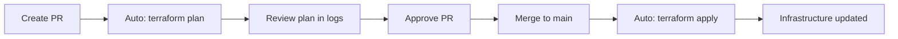

# Pull Request Workflow

Automated Terraform pipeline with plan-on-PR and apply-on-merge workflow.

## 🔄 How It Works



### Workflow Stages

| Event | Trigger | Action | Config File |
|-------|---------|--------|-------------|
| **PR opened/updated** | `pr-plan-all-workspaces` | Run `terraform plan` only | `cloudbuild-plan.yaml` |
| **Merged to main** | `main-apply-all-workspaces` | Run `terraform apply` | `cloudbuild.yaml` |
| **Feature branch push** | `feature-branch-test` | Run validation tests | `cloudbuild-test.yaml` |

## 🚀 Quick Setup

### 1. Run Setup Script

```bash
chmod +x setup-pr-workflow.sh
./setup-pr-workflow.sh cluster-dreams
```

This creates three Cloud Build triggers:
- ✅ Plan on PRs
- ✅ Apply on main
- ✅ Test on feature branches

### 2. Verify Triggers

```bash
gcloud builds triggers list --region=us-central1 --project=cluster-dreams
```

You should see:
- `pr-plan-all-workspaces`
- `main-apply-all-workspaces`
- `feature-branch-test`

### 3. Test the Workflow

```bash
# Create a test branch
git checkout -b test/pr-workflow

# Make a small change
echo "# Test PR workflow" >> README.md

# Commit and push
git add README.md
git commit -m "Test PR workflow"
git push origin test/pr-workflow

# Create PR via GitHub UI or gh CLI
gh pr create --title "Test PR workflow" --body "Testing automated plan"

# Check Cloud Build for plan output
gcloud builds list --limit=5
```

## 💬 Enable PR Comments (Optional)

Post Terraform plan summaries directly to PR comments.

### Prerequisites

1. **GitHub Personal Access Token** with `repo` scope
2. **Secret Manager** to store the token
3. **IAM permissions** for Cloud Build to access secrets

### Setup Steps

#### 1. Create GitHub Token

```bash
# Create token via GitHub UI or API
# Required scopes: repo (full control of private repositories)
# https://github.com/settings/tokens/new
```

#### 2. Store in Secret Manager

```bash
# Enable Secret Manager API
gcloud services enable secretmanager.googleapis.com --project=cluster-dreams

# Create secret (paste token when prompted)
echo -n "ghp_your_token_here" | gcloud secrets create github-token \
    --project=cluster-dreams \
    --data-file=-

# Verify
gcloud secrets describe github-token --project=cluster-dreams
```

#### 3. Grant Cloud Build Access

```bash
# Get project number
PROJECT_NUMBER=$(gcloud projects describe cluster-dreams --format="value(projectNumber)")

# Grant access
gcloud secrets add-iam-policy-binding github-token \
    --project=cluster-dreams \
    --member="serviceAccount:${PROJECT_NUMBER}@cloudbuild.gserviceaccount.com" \
    --role="roles/secretmanager.secretAccessor"
```

#### 4. Test PR Comments

Create a new PR and check for automated comment with plan summary.

## 📋 What Gets Posted to PRs

When PR comments are enabled, each plan run posts:

```markdown
## 📋 Terraform Plan Summary

**Build ID**: `abc123`
**Commit**: `1234567`
**Branch**: `feature/my-changes`

---

### 📦 Workspace: `gitops`
```
Plan: 0 to add, 2 to change, 0 to destroy.
```

### 📦 Workspace: `dev`
```
No changes. Your infrastructure matches the configuration.
```

### 📦 Workspace: `staging`
```
Plan: 1 to add, 0 to change, 0 to destroy.
```

---

[View full build logs](https://console.cloud.google.com/cloud-build/builds/abc123)

> 🤖 Posted by Cloud Build
> 💡 Merge this PR to apply these changes to infrastructure
```

## 🔒 Security & Best Practices

### Protected Main Branch

Configure branch protection rules:

```bash
# Via GitHub UI:
# Settings → Branches → Add rule for 'main'
# ✅ Require pull request reviews before merging
# ✅ Require status checks to pass before merging
#    - Add: pr-plan-all-workspaces
# ✅ Require conversation resolution before merging
# ✅ Do not allow bypassing the above settings
```

### Review Checklist

Before approving a PR:

- [ ] Review terraform plan output in Cloud Build logs
- [ ] Verify expected resources will be created/modified/destroyed
- [ ] Check for unexpected changes (should be 0 if just testing)
- [ ] Ensure no secrets or sensitive data in plan
- [ ] Verify all workspaces (gitops, dev, staging) planned successfully
- [ ] Check security scan results (Trivy, Checkov)

### Rollback Strategy

If a merge causes issues:

```bash
# Option 1: Revert the merge commit
git revert <merge-commit-sha>
git push origin main
# This triggers another apply that undoes changes

# Option 2: Manual terraform destroy/apply
# Use this if automated revert isn't safe
gcloud builds submit --config=cloudbuild.yaml --substitutions=_MANUAL_ROLLBACK=true
```

## 📊 Monitoring & Debugging

### View Build History

```bash
# All builds
gcloud builds list --limit=20

# PR plans only
gcloud builds list --filter="buildTriggerId:pr-plan-all-workspaces" --limit=10

# Main applies only
gcloud builds list --filter="buildTriggerId:main-apply-all-workspaces" --limit=10
```

### Debug Failed Plans

```bash
# Get build ID from PR or commit status
BUILD_ID="abc-123-def"

# View logs
gcloud builds log $BUILD_ID --stream

# Get detailed status
gcloud builds describe $BUILD_ID
```

### Common Issues

#### PR trigger not firing

```bash
# Check trigger configuration
gcloud builds triggers describe pr-plan-all-workspaces --region=us-central1

# Check GitHub app connection
gcloud builds connections list --region=us-central1

# Re-sync GitHub app
# Go to: https://console.cloud.google.com/cloud-build/triggers/connect
```

#### Plan succeeds but no PR comment

```bash
# Check if secret is accessible
gcloud secrets versions access latest --secret=github-token

# Verify IAM permissions
gcloud secrets get-iam-policy github-token

# Check build logs for comment posting step
gcloud builds log $BUILD_ID | grep -A 20 "post-pr-comment"
```

#### Main apply fails after PR merge

```bash
# This can happen if:
# 1. State drift between plan and apply
# 2. Manual changes made in GCP Console
# 3. Concurrent applies

# Solutions:
# - Ensure no manual changes in Console
# - Don't merge multiple PRs simultaneously
# - Check state lock in GCS bucket
```

## 🎯 Advanced Configuration

### Custom Plan Filters

Filter which workspaces get planned on PRs:

Edit `cloudbuild-plan.yaml`:

```yaml
# Only plan changed workspaces
- id: detect-changes
  name: alpine/git
  entrypoint: sh
  args:
  - -c
  - |
    # Check which files changed
    git diff --name-only origin/main...HEAD > /workspace/changed_files.txt

    # Determine which workspaces need planning
    if grep -q "modules/dev" /workspace/changed_files.txt; then
      echo "dev" >> /workspace/workspaces_to_plan.txt
    fi
    # ... etc
```

### Parallel Planning

Speed up plans by running workspaces in parallel:

```yaml
# Remove waitFor dependencies between plan steps
- id: plan-gitops
  waitFor: [terraform-init]  # Only wait for init

- id: plan-dev
  waitFor: [terraform-init]  # Not plan-gitops

- id: plan-staging
  waitFor: [terraform-init]  # Not plan-dev
```

⚠️ **Note**: Only safe if workspaces don't have dependencies!

### Conditional Apply

Apply only specific workspaces based on labels or file changes:

```yaml
# In cloudbuild.yaml
substitutions:
  _APPLY_GITOPS: 'true'
  _APPLY_DEV: 'true'
  _APPLY_STAGING: 'true'

# In apply steps:
- id: apply-dev
  name: hashicorp/terraform:1.11
  entrypoint: sh
  args:
  - -c
  - |
    if [ "${_APPLY_DEV}" = "true" ]; then
      terraform apply ...
    else
      echo "Skipping dev workspace"
    fi
```

## 📚 Related Documentation

- [CLAUDE.md](./CLAUDE.md) - GCloud aliases and project context
- [SCHEDULED-DESTROY.md](./SCHEDULED-DESTROY.md) - Automated cost savings
- [cloudbuild.yaml](./cloudbuild.yaml) - Main apply pipeline
- [cloudbuild-plan.yaml](./cloudbuild-plan.yaml) - PR plan pipeline
- [cloudbuild-test.yaml](./cloudbuild-test.yaml) - Validation tests

## 🤝 Contributing

### Making Changes to the Pipeline

1. Create feature branch: `git checkout -b feature/pipeline-improvement`
2. Modify cloudbuild files
3. Test locally: `gcloud builds submit --config=cloudbuild-test.yaml`
4. Create PR
5. Review plan output
6. Merge to main
7. Monitor apply in Cloud Build

### Pipeline Development Best Practices

- ✅ Test changes with `cloudbuild-test.yaml` first
- ✅ Use `_SUBSTITUTIONS` for configurable values
- ✅ Add descriptive step IDs and names
- ✅ Include timeout values for all steps
- ✅ Log important information for debugging
- ✅ Handle failures gracefully (don't use `set -e` everywhere)
- ✅ Document new steps in this file

## 🔍 Troubleshooting Guide

### Symptom: Plans take too long

**Cause**: Sequential workspace planning
**Solution**: Enable parallel planning (see Advanced Configuration)

### Symptom: Plan shows changes on every PR

**Cause**: Possible state drift or dynamic values
**Solution**:
- Check for `timestamp()` or `uuid()` in configs
- Use `lifecycle { ignore_changes }` for dynamic attributes
- Verify no manual changes in GCP Console

### Symptom: Apply fails with "resource already exists"

**Cause**: Resource created outside Terraform
**Solution**:
```bash
# Import the resource
terraform import google_compute_network.default projects/cluster-dreams/global/networks/shared-network

# Or remove and let Terraform recreate
terraform state rm google_compute_network.default
```

### Symptom: GitHub token expired

**Cause**: PAT has expiration date
**Solution**:
```bash
# Create new token
# Update secret
echo -n "ghp_new_token" | gcloud secrets versions add github-token --data-file=-
```

## 📞 Support

For issues:
1. Check [Cloud Build logs](https://console.cloud.google.com/cloud-build/builds?project=cluster-dreams)
2. Review this documentation
3. Search [GitHub issues](https://github.com/muyisbox/gke/issues)
4. Open new issue with build ID and error logs
